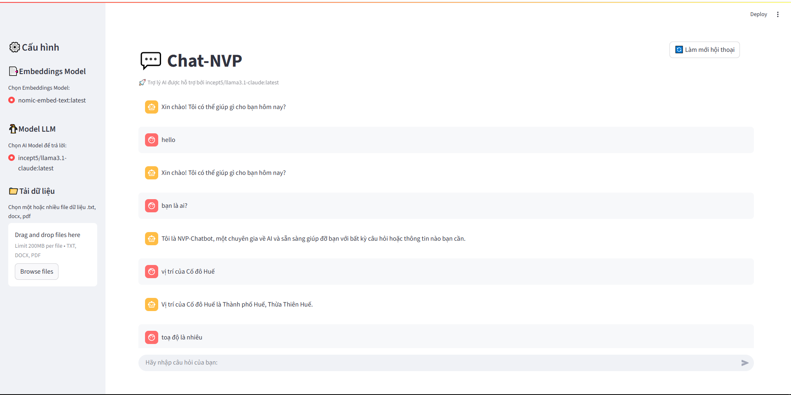

# 💬 FREE NVP-Chatbot RAG | Trợ lý AI kết hợp Ollama Llama3 + LangChain

Một hệ thống chatbot thông minh tích hợp mô hình ngôn ngữ lớn Ollama Llama3 với cơ chế Retrieval-Augmented Generation (RAG) để truy xuất và trả lời từ các tài liệu do người dùng cung cấp.

## Demo


## 🎯 Mục tiêu dự án

Giúp người dùng đặt câu hỏi và nhận câu trả lời chính xác từ các tài liệu PDF, DOCX, hoặc TXT của riêng họ. Hệ thống tận dụng sức mạnh của LLM và retriever (FAISS + BM25) để đưa ra phản hồi chính xác, có dẫn chứng.

## 🧠 Kiến trúc hệ thống
```
Người dùng ↔️ Streamlit UI ↔️ LangChain Agent ↔️ Ollama Llama3 LLM 
                            ↘️ VectorStore (FAISS + BM25 từ tài liệu)
```

- **LLM:** Ollama Llama3 (`incept5/llama3.1-claude:latest`)
- **Embeeding model:** OllamaEmbeddings (`nomic-embed-text:latest`)
- **Retriever:** Kết hợp FAISS (embedding) và BM25 (từ khóa)
- **VectorStore:** FAISS
- **UI:** Streamlit (hỗ trợ trò chuyện thời gian thực)
- **RAG pipeline:** Truy xuất tài liệu → Trả lời có dẫn chứng

## 🚀 Tính năng chính

- **Giao diện Web thân thiện:** Xây dựng bằng Streamlit, cho phép người dùng tương tác dễ dàng.
- **Hỗ trợ đa dạng định dạng tài liệu:** Có thể tải lên và xử lý các tệp `.txt`, `.docx`, và `.pdf`.
- **Cơ chế Retrieval tiên tiến:** Kết hợp theo tỉ lệ 7:3 giữa tìm kiếm dựa trên vector (FAISS) và tìm kiếm dựa trên từ khóa (BM25) để tăng độ chính xác của thông tin được truy xuất.
- **Tích hợp Ollama Llama3:** Sử dụng mô hình mạnh mẽ như `incept5/llama3.1-claude:latest` để tạo ra câu trả lời chất lượng cao.
- **Lưu trữ và quản lý lịch sử hội thoại:** Giúp chatbot duy trì ngữ cảnh trong suốt cuộc trò chuyện.
- **Cấu hình linh hoạt:** Cho phép người dùng tùy chọn mô hình embedding và mô hình LLM ngay trên giao diện.

## 🧱 Cấu trúc thư mục
```
├── main.py                 # Giao diện và điều khiển chính bằng Streamlit 
├── llm.py                  # Hàm gọi LLM và thiết lập retriever 
├── seed_data.py            # Xử lý và vector hóa tài liệu 
├── data/                   # Thư mục chứa file tài liệu người dùng upload 
├── requirements.txt        # Danh sách thư viện cần thiết
```

## ⚙️ Cài đặt và Chạy dự án

### 1. Các bước cài đặt

**a. Cài đặt các thư viện cần thiết:**

```
pip install -r requirements.txt
```

**b. Cài đặt và khởi động Ollama:**
- Tải và cài đặt Ollama tại https://ollama.com/
- Tải model Llama3:
```
ollama pull incept5/llama3.1-claude:latest
```
- Khởi động Ollama server (thường tự động chạy tại http://localhost:11434)

### 2. Chạy ứng dụng
Sau khi hoàn tất các bước cài đặt, chạy ứng dụng Streamlit bằng lệnh sau:
```
streamlit run main.py
```

### 3. Tương tác
- 📤 Upload file tài liệu từ sidebar.
- 🧠 Đặt câu hỏi trong hộp thoại chat.
- 💬 Chatbot sẽ tìm câu trả lời trong tài liệu bạn đã tải lên

## Liên hệ
Có câu hỏi thắc mắc xin vui lòng liên hệ qua email: nguyenphuongv07@gmail.com.
